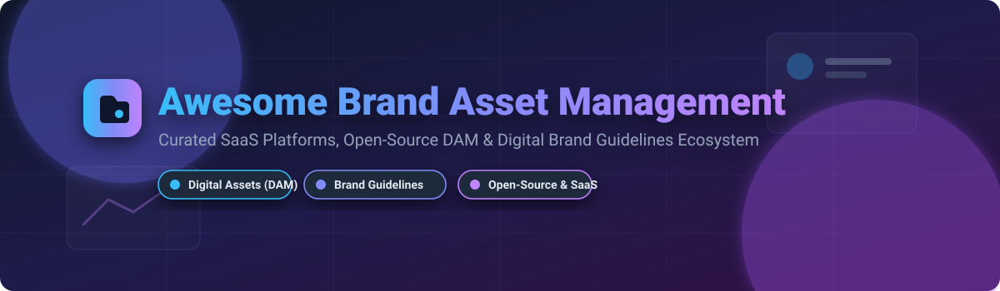

# Awesome Brand Asset Management 🎨💼

   

## 🚀 Top Brand Asset Management & Digital Asset Management Ecosystem 📁✨

**Curated List of Enterprise SaaS Products & Open-Source GitHub Projects**  
*Focused on Digital Asset Management (DAM), Brand Asset Management (BAM), Brand Consistency & Creative Workflows*  

**Last updated: September 2026** 📅

This repository tracks notable **SaaS platforms** and **open-source software** for **Brand Asset Management (BAM)** and **Digital Asset Management (DAM)**. These software solutions empower marketing teams, creative agencies, brand managers, and software developers to store, organize, index, retrieve, share, and distribute digital brand assets—such as vector logos, brand guidelines, color palettes, fonts, stock photography, and video collaterals—ensuring brand compliance across global channels. 🌐✨

---

## 📑 Table of Contents
- [📊 Market Overview & Industry Insights](#-market-overview--industry-insights)
- [☁️ SaaS / Hosted Platforms](#️-saas--hosted-platforms)
- [💻 Open-Source GitHub Projects](#-open-source-github-projects)
- [🤝 How to Contribute](#-how-to-contribute)
- [💖 Support & Sponsorship](#-support--sponsorship)
- [📈 Star History](#-star-history)
- [⚠️ Disclaimer](#%EF%B8%8F-disclaimer)

---

## 📊 Market Overview & Industry Insights 💡

> **Market Size & Valuation:** The global Digital Asset Management (DAM) and Brand Asset Management market is projected to reach between **USD 6.3 Billion and USD 7.5 Billion in 2026**, expanding at a robust CAGR of **13.9% to 18.6%**.  
> **Market Structure:** The sector exhibits **moderate fragmentation**. Rather than being a strictly "winner-take-all" market, it hosts established enterprise behemoths (such as Acquia, Bynder, and Adobe) alongside high-growth cloud-native platforms and agile open-source projects catering to developer-first brand workflows. 🏢🚀

---

## ☁️ SaaS / Hosted Platforms 🌐

| Product 🛠️ | Description 📝 | Starting Price 💵 | Free Tier / Trial Limit ⏳ | Company Size (Revenue / Valuation) 📈 |
| :--- | :--- | :--- | :--- | :--- |
| **[Acquia DAM](https://www.acquia.com/products/dam)** | Enterprise DAM (formerly Widen) integrated with Drupal, offering brand portals, asset delivery, and marketing workflow tools. | $20,000 / year ($1,666/mo billed annually) | No free tier; custom guided demo available | ~$1.0B Valuation ($200M+ ARR) |
| **[Bynder](https://www.bynder.com/)** | Enterprise DAM with brand templating, creative workflow automation, and analytics. | $450 / month ($5,400/year billed annually) | No free tier; 14-day free trial on request | ~$600M Valuation ($130M ARR) |
| **[Brandfolder](https://brandfolder.com/)** | Digital asset management platform with AI-powered search, brand portals, and marketing workflow integrations. | $500 / month ($6,000/year billed annually) | No free tier; guided sandbox trial via sales demo | $155M Acquisition Valuation ($15.6M ARR) |
| **[MediaValet](https://www.mediavalet.com/)** | Cloud-native DAM built for enterprise with AI, workflow automation, and brand compliance tools. | $500 / month ($6,000/year billed annually) | No free tier; free full-system sandbox after sales consultation | $80M CAD (~$60M USD) Valuation |
| **[Frontify](https://www.frontify.com/)** | Brand management platform combining DAM with brand guidelines, design templates, and team collaboration. | $79 / month | No free tier; 14-day free trial for Essentials & Growth plans | ~$60M ARR ($80.6M Total Funding) |
| **[Canto](https://www.canto.com/)** | DAM platform focused on ease of use, with facial recognition, custom portals, and metadata management for brand assets. | $600 / month ($7,200/year billed annually) | No free tier; 7-day free trial upon request | ~$52M ARR |
| **[Aprimo](https://www.aprimo.com/)** | Integrated marketing operations platform with DAM, content operations, and performance analytics. | $1,500 / month ($18,000/year billed annually) | No free tier; free trial available upon request | ~$35.2M ARR |
| **[IntelligenceBank](https://www.intelligencebank.com/)** | DAM with marketing compliance, brand portals, and creative workflow management. | $500 / month ($6,000/year billed annually) | No free tier; tailored trial via product demo | ~$11.5M ARR ($37M Total Funding) |
| **[Filecamp](https://filecamp.com/)** | Digital asset management for smaller teams and agencies, with brand guidelines, file sharing, and custom portals. | $29 / month (Basic plan, 20 GB) | No free tier; 30-day free trial (no credit card required) | ~$3.2M ARR |
| **[MarcomCentral](https://marcomcentral.com/)** | Brand asset management and marketing asset management for enterprise brand consistency. | $250 / month | Free plan available via MarcomGather (5 GB storage, 3 users max); free trial for main platform | Subsidiary of Ricoh ($14B+ parent market cap) |

---

## 💻 Open-Source GitHub Projects 🔓

Below is a curated list of active open-source brand asset management and digital asset management repositories, sorted descending by GitHub star count ⭐:

1. **[Immich](https://github.com/immich-app/immich)**   
   High-performance self-hosted media and photo asset backup solution with AI-powered tagging, face recognition, and multi-device sync. 📸📱

2. **[PhotoPrism](https://github.com/photoprism/photoprism)**   
   AI-powered web-based digital photo and visual asset management app for browsing, organizing, and categorizing image collections. 🖼️🤖

3. **[Lychee](https://github.com/LycheeOrg/Lychee)**   
   Free and open-source photo-management tool for hosting and sharing visual media assets securely on your server. 🌅🔒

4. **[Pimcore Community Edition](https://github.com/pimcore/pimcore)**   
   Open-source platform for Product Information Management (PIM), Master Data Management (MDM), and Digital Asset Management (DAM). 📦🏢

5. **[TagSpaces](https://github.com/tagspaces/tagspaces)**   
   Extensible open-source offline-first file manager and asset organizer utilizing tag-based metadata for local and cloud files. 🏷️📂

6. **[digiKam](https://github.com/KDE/digikam)**   
   Professional open-source desktop digital asset and photo management software suite with facial recognition and advanced metadata editor. 💻📷

7. **[Phraseanet](https://github.com/alchemy-fr/Phraseanet)**   
   Enterprise open-source DAM solution for managing photos, video, audio, and documents with Elasticsearch and IPTC/XMP metadata indexing. 🎥📄

8. **[Razuna](https://github.com/Razuna/razuna)**   
   Open-source digital asset management server for centralizing, organizing, and serving brand digital assets securely. 🗄️⚡

9. **[ResourceSpace](https://github.com/resourcespace/resourcespace)**   
   The widely adopted open-source DAM platform designed for enterprise asset organization, brand guidelines, and permissions management. PHP/MySQL-based. 🏛️🌐

10. **[hyper Content & Digital Asset Management Server](https://github.com/hyperCMS/hyperCMS)**   
    Open-source solution for automated brand and marketing asset management, media workflows, and product content publishing. ⚙️📊

11. **[FocusOPEN Digital Asset Manager](https://github.com/mindworx/focusopen)**   
    Web-based open-source software for digital asset management, media cataloging, and institutional archive collections. 🏛️🔍

12. **[open-brandkit](https://github.com/open-brandkit/open-brandkit)**   
    Source-available tool built with Next.js & Tailwind CSS that converts raw brand files into polished, shareable brand kits and design tokens. 🎨⚡

13. **[brand-assets-ecosystem](https://github.com/b-ciq/brand-assets-ecosystem)**   
    Multi-interface brand asset management system featuring web GUI (Next.js), MCP server integration, and shared SDKs. 🔌🌐

14. **[@mcptoolshop/brand](https://github.com/mcp-tool-shop-org/brand)**   
    Centralized GitHub-native brand asset registry with CLI audit tools and auto-syncing GitHub Actions. 🐙🔄

---

## 🤝 How to Contribute 📝

Contributions from the community are warmly welcome! 🙌

1. **Fork** the repository 🍴
2. **Add or edit** entries in `README.md` following the standard table/list format.
3. Ensure you include: Project Name, Official Link, Star Badge (for open-source), clear summary, and accurate pricing/metrics.
4. Submit a **Pull Request (PR)** with a clear title describing your changes! 🚀

---

## 💖 Support & Sponsorship ☕

If you find this curated list of Brand Asset Management tools valuable for your organization or project, please consider supporting the effort! 🌟

- **Star** this repository to increase visibility on GitHub! ⭐
- **Fork** and share it with your marketing, design, and engineering teams! 📢
- **Sponsor the Maintainer:** You can buy me a coffee and sponsor ongoing updates via the GitHub Sponsor Dashboard:  
  👉 **[Sponsor @ishandutta2007 on GitHub](https://github.com/sponsors/ishandutta2007)** ☕💖

Thank you for supporting open source and open brand asset standards! 🙏

---

## 📈 Star History 🌟

---

## ⚠️ Disclaimer 📜

- This is a **community-curated resource list** and does not constitute endorsement or commercial sponsorship.
- Brand asset management solutions must comply with corporate copyright, trademark, and usage licensing terms.
- Self-hosted open-source software requires dedicated infrastructure, monitoring, and ongoing security maintenance.

---

<b>Made with ❤️ for brand managers, marketing professionals, creative directors, and software developers.</b>

